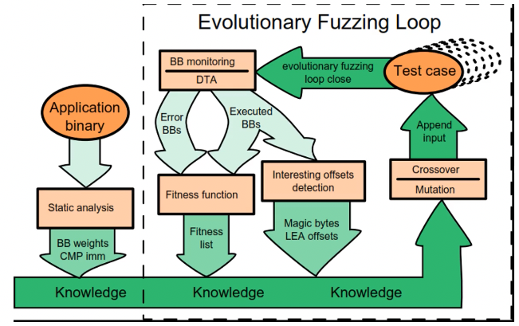

+++
title = 'Fuzzing'
+++
# Fuzzing
Looking for bugs: code review, static analysis, testing
- these are hard to scale

Fuzzing/fuzz testing:
- find vulnerabilities by repeatedly testing program with modified inputs
- different kinds of fuzzers

Different types of fuzzers:
- input:
    - mutational
        - mutate seed inputs to create new test inputs
        - common mutations:
            - bit flip: flip nth bit of input (e.g. AFL fuzzer)
            - byte flip: flip nth byte of input
            - arithmetic: add n, subtract n, multiply by n, etc.
            - insert/delete n bytes in input
            - cross-over: combine two inputs (e.g. Vuzzer)
        - ideally want to select fitness: discard unsuccessful inputs
            - fitness e.g. does input execute new code, does input get us close to some target code
        - problem: many invalid inputs because lack of input format
    - generative (know full input grammar)
        - learn/create format/model on input, use it to generate new inputs
        - problem: hard to get right input format, might miss bugs related to invalid inputs
- strategy: feedback, no feedback
- app transparency: black-box, grey-box, white-box
    - black-box: only interface known. difficult to access effectiveness
    - white-box: all is known. better understanding of effect of input, but slow and harder to scale
    - grey-box: use some knowledge
- objective: guided/targeted, coverage-based
    - coverage-based: the more code we cover, the more bugs we find (e.g. AFL, VUzzer)
    - target: try to reach specific set of targets (e.g. Parmesan)
    - hybrid: aim for targets while increasing coverage

Improving traditional fuzzing:
- apply heuristics to:
    - mutate better
    - learn good inputs
- apply analysis to understand application behavior

VUzzer:

