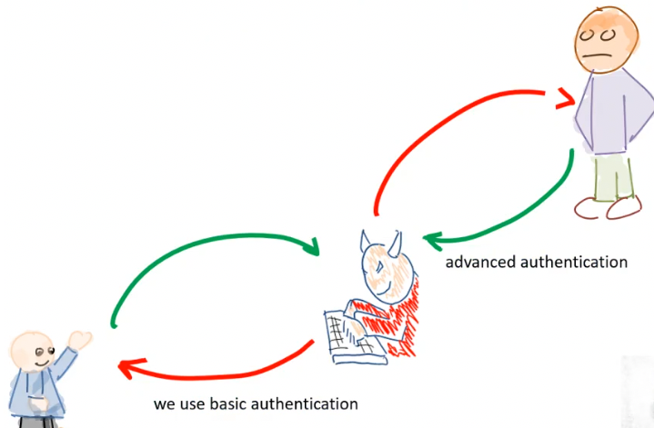
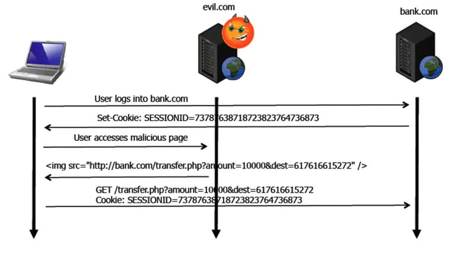

+++
title = 'Web security'
+++

# Web Security
Request:
- header and optional body, separated by empty line (CRLF)
- header specifies:
    - method:
        - GET: transfer of entity referred to by URL
        - HEAD: transfer of header meta-information
        - POST: send data
        - etc.
    - resource: absolute URI or absolute path (starting with slash)
    - host:
        - in HTTP 1.0, can't tell from request which server was intended to process request
        - in HTTP 1.1, mandatory, and allows multiple servers on the same IP address
- HTTP/2 is similar to HTTP/1.1, but more features. e.g. allows server to "push" more data

Reply:
- header and body separated by CRLF
- header contains: protocol version, status code, diagnostic text, other info
- body is a byte stream

URI syntax: `<scheme>://<authority><path>?<query>`

HTTP authentication:
- simple challenge-response
- challenge returned as part of 401 reply, specifies schema to be used
- auth request refers to 'realm' (set of resources on server)
- client must include Authorization header field with required valid credentials

Basic HTTP authentication
- server replies with 401 message containing header field: `WWW-Authenticate: Basic realm="whatever"`
- client retries access, including cookie composed of base64-encoded username and password (easily readable)

HTTP1.1 authentication:
- defines authentication scheme based on cryptographic digests
    - server sends nonce as challenge
    - client sends request with digest of username, password, given nonce, HTTP method, and requested URL
- web server has to have access to cleartext passwords
- but man-in-the-middle (MITM) still possible, with using basic auth with client and then advanced with server



Web Authentication API
- allows strong auth with public key crypto, passwordless, second-factor, etc.
- relies on entities outside the browser, like authentictors

Maintaining state
- HTTP is stateless, but web apps often require state
- can be achieved by:
    - embedding info in URLs: `GET /login.php?user=foo&pwd=bar HTTP/1.1`
    - hidden form fields: `<input type="hidden" name="user" value="foo" />`
    - cookies: via header `Set-Cookie: USER=foo; SHIPPING=fedex; path=/`
        - cookies are passed in every further transaction with the same site, in the `Cookie` header
        - only accessible by the site that set them
        - can have number of fields, in the form `<name>=<value>`
            - can have `expires` key for expiration date
            - `domain` for more generic domain
            - `secure` to only send via SSL connections
            - `httponly` to make it inaccessible to client-side scripts
        - a server can only set a limited number of cookies

Sessions:
- represent time-limited interaction of user with web server
- no concept at HTTP level, so use the state mechanisms above
- generate unique ID at start of session, then use it to access info on server side

## Server-side
### Common Gateway Interface (CGI)
Way to invoke programs on server side, with input returning to client.
Input passed via URL or body in POST.

CGI programs can be written in any language, and input piped to process's stdin.
Parameters are passed via environment variables.

### Active Server Pages (ASP, ASP.NET)
Pages that contain mix of text, HTML tags, scripting directives, and server-side includes.

Directives are executed on server side before serving the page.

### Servlets and JavaServer pages (JSP)
Servlets: Java programs executed on server (similar to CGI). Can run in existing JVM, without making a new process.

JSP are static HTML mixed with Java code, and are compiled into servlets.

### PHP
Scripting language that can be embedded in HTML.
PHP code executed on server side when the page containing the code is requested.
Common way is to have a LAMP stack.

### Web App Frameworks
Support rapid development, might be based on existing web severs or might have their own.
Often based on model-view-controller pattern, and provide automated translation of objects to/from database.
Example is Ruby on Rails.

## Client-side
### Java Applets
Compiled Java programs that are downloaded and executed in context of a web page.

### ActiveX
Binary, OS-specific programs downloaded and executed in context of a web page.
Code signed via Authenticode mechanism.
Once executed, have complete access to client's environment.

### JavaScript/JScript, EcmaScript/VBScript
Scripting languages for dynamic behavior in web pages.

### asm.js
Subset of JS that allows for very fast code.
Can use compiler passes to translate e.g. C code to asm.js

### webassembly
Low-level bytecode for client-side scripting, supports compilation from C/C++.

### Global structure:
"Window": top hierarchy of objects

DOM: document object model
- interface to manipulation of client-side content

BOM: browser object model
- interface to browser properties

### JS security
JS code downloaded as part of HTML page, executed on-the-fly.
Security guaranteed by sandboxing:
- no access to files
- no access to network resources
- etc.

Security policies:
- same origin: JS can only access resources (e.g. cookies) associated with same origin (e.g. vu.nl)
    - every frame in browser is associated with domain ("origin")
    - web browser permits script contained in first web page to access data in second web page _only if same origin_
        - same URI scheme + exact hostname + port number
    - if frame explicitly includes external code, it executes within the same frame domain!
- signed script: signature on JS code is verified and principal identity extracted, identity compared to policy file to determine level of access
- configurable: user can manually modify policy file to allow/deny access

Site isolation (Google Chrome): pages from different websites are different processes, each in a sandbox.

### AJAX (Asynchronous JavaScript and XML)
Lets JS modify web page based on result of request, without need for explicit user interaction.

XML HTTP request:
- allows JS to retrieve XML data from server by querying from JS
- use `onreadystatechange` property of XML-HTTP object to run a callback
- `onreadystatechange` callback is called on any state change, so you can check the current state

## Web attacks
### Against authentication
What's the best way to authenticate?
- IP address: can be spoofed, and same user could use different IPs
- HTTP-based: not scalable, hard to manage at application level (lots of options for digest)
- Cert-based: works on server-side for SSL, few users have "real" certs or know how to use them
- Form-based: data might be sent in the clear

'Basic' authentication:
- form used to send username and password over SSL
- app verifies credentials, generates session authenticator (typically a cookie)
- authenticators should not have predictable values
- authenticators shouldn't be reusable across sessions
- better to store random value with other session info in file or backend database

If app includes authenticator in URL, browsers may leak info as part of "Refer" field.

Expiration info should be stored on server side, or included in cookie in cryptographically secure way.

Attacking it:
- eavesdropping
    - if HTTP connection not protected by SSL, you can eavesdrop
    - name and password are sent as part of HTTP basic auth exchange
- bruteforcing/guessing
    - if authenticators have limited values, can be bruteforced
    - if not random, can be guessed
- bypassing
    - weak recovery procedures can be used to change a password to whatever you want
    - session fixation forces user's session ID to a known value

### Against authorization
Authorization: what can a user do?

Path/directory traversal: break out of document space by using relative paths

Forceful browsing: manually jump to any publicly available resource

Automatic directory listing: if no index.html in directory, browser returns listing of the files

Parameter manipulation: changing parameters of valid request

Parameter creation: add new parameters manually, such as `&admin=1`

Server misconfiguration: e.g. if data can be uploaded via FTP and executed via a web request

Command injection: incorrect validation of user input that leads to executing commands on the server

### Server-side includes (SSI)
Simple interpreted server-side scripting language.

You can introduce directives into web pages.
Syntax: `<!-- #element attribute=value ... -->`

These can also have things like `#exec`, which is a security problem.

### Command injection in PHP
If `allow_url_fopen` is set, you can use URLs in `include()` and `require()`.
If user input is used to create the filename, then you can execute arbitrary code.

### HTML injection
You can inject HTML tags to modify behavior of a web page, e.g. an `iframe`, or forms to collect user's credentials.

### Preventing command injection
Command injection is a sanitization problem, so don't trust outside input. Always sanitize.

### SQL injection
SQL queries are built using parameters provided by users.
If a user provides special characters, they can modify queries, find out about stored procedures in database, and even run commands.

If you build a query like this:

```asp
var sql = "select * from user_accounts where username = '" + username + "' and password = '" + password + "'";
```

You can provide the input `' or 1=1 --` for username to get a string like this:

```sql
select * from user_accounts whre username='' or 1=1--' and password=''
```

Since 1=1 is always true, you get all of the records in the table.

You can use this to run subqueries, and if the result is reflected back, you can extract info from other tables.

Identifying SQL injections:
- negative approach: special-meaning characters in query will cause an error
- positive approach: provide expression that would not cause an error (e.g. `''Foo` instead of `Foo`)

Number of columns in a query can be determined using progressively longer NULL columns until correct query is returns (i.e. `UNION SELECT NULL`, `UNION SELECT NULL, NULL`, etc.)

If you want to figure out which column has a string: `UNION SELECT 'foo', NULL, NULL`, `UNION SELECT NULL, 'foo', NULL`, etc.

### Second order SQL injection
SQL code injected into application, but statement invoked at later point in time.
Even if application escapes single quotes, second order SQL injection might be possible.
E.g. if you save a 'favorite search' which contains an SQL injection, and then select it later, running the injection.

### Blind SQL injection
If you have no feedback, you can use `AND 1=1` to check if input is sanitized.

### XSS
XSS (Cross-site scripting): used to bypass JS's same origin policy
- reflected attacks: injected code reflected off web server, e.g. in an error message
    - e.g. including JS code inside of a link, which is reflected on the 404 page (and thus executed)
- stored attacks: injected code permanently stored on the server e.g. in a database

Preventing XSS:
- every piece of data returned to user that can be influenced by input must first be sanitized
- languages often provide routines to help with this
- sanitization has to be done differently depending on where the data is used
- rules:
    0. never insert untrusted data except in allowed locations
    1. HTML escape before inserting untrusted data into HTML element content
    2. attribute escape before inserting untrusted data into HTML common attributes
    3. JS escape before inserting into HTML JS data values
    4. CSS escape before inserting into HTML style property values
    5. URI escape before inserting into HTML URL attributes
- use `httponly` on cookies to prevent access by scripts

### Cross-site request forgery (CSRF)
Allows attacker to execute requests on behalf of victim.

"Confused deputy attack": browser uses victim's authority to do what the attacker wants



Preventing:
- HTML-only: web server embeds token (secret & unique value) for each request, in all HTML forms, verified on server side
- header-based (for JS sites)
    - on login, web app sets cookie containing random token that stays same for whole session
    - JS on client side copies it into custom HTTP header. Only JS within the same origin.
    - server validates this

### Server-side request forgery (SSRF)
Suppose the server is asked to make a request to some back-end API like this:

```
POST /product/stock HTTP/1.0
Content-Type: application/x-www-form-urlencoded
Content-Lenth: 118

stockApi=http://stock...
```

If the attacker can change the URL, it can provide something like

```
POST /product/stock HTTP/1.0
Content-Type: application/x-www-form-urlencoded
Content-Length: 118

stockApi=http://localhost/admin
```

This means that server accesses its own admin URL, which is inaccessible from the outside but not checked from localhost.

another attack is clickjacking:
- user visits attacker's website
- website has transparent iframe with target site on top
- click leads to opening a popup

### HTTP response splitting
Exploits the fact that user provided data is in header of reply.

For example, if setting language to english gives you a redirect like this:

```
HTTP/1.1 302 Moved Temporarily
Date: ...
Location: http://10.1.1.1/by_lang.jsp?lang=English
...
<html>Error</html>
```

You can provide URL-encoded headers inside of lang, which can be interpreted.

### HTTP request smuggling
You can add a space after a header, without CRLF, and then an 'inner' HTTP request:

![Request smuggling example])(http-request-smuggling.png)

### PHP type juggling
PHP has loose (`==`) and strict (`===`) comparisons.

When comparing string to number, PHP tries to convert the string to the appropriate number.
If both operands look like numbers, PHP converts both to numbers and does numeric comparison.

### Python Pickle
Serialization of python datatypes.

Pickle allows arbitrary objects to be pickled by providing a `__reduce__` method, which should return:
- a string
- or tuple describing how to reconstruct object
