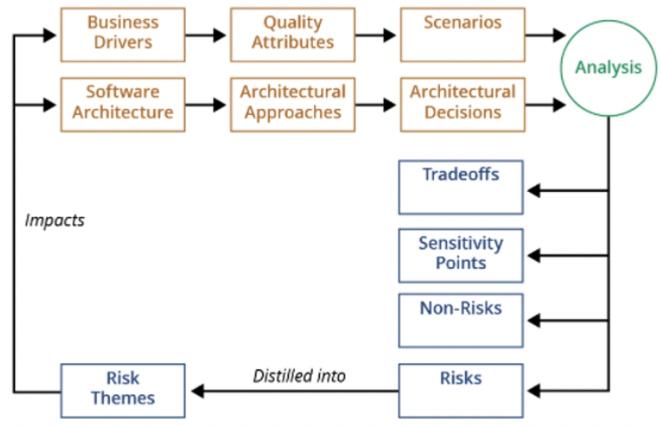

+++
title = 'Architecture & quality'
+++
# Architecture & quality
## Quality
Architecture is critical for realization of qualities.
The implementation details of architecture achieve the qualities.
Qualities are not achieved in isolation, but they interact.

Why not quality attributes?
- not testable
- concerns of QAs overlap
- each QA community has own vocabulary

Approaches to defining quality:
- transcendental: I can't define it, but know it when I like it
- product-based: related to attributes of software
- user-based: fitness for use, user preferences
- manufacturing-based: conformance to specs
- value-based: deals with costs and profits

ISO 25010 ("product characteristics"): functional suitability, performance efficiency, compatibility, usability, reliability, security, maintainability, portability

How do you go from quality to architecture?
- decompose QA scenarios into tactics
    - tactics: design decisions influencing achievement of quality attribute _response_
    - one tactic focuses on one QA (no tradeoffs), tactics are packaged in design patterns (which do have tradeoffs)
        - design pattern: recurring structure of communicating components that solve general design problem in a particular context (like "model-view-controller")
    - tactics can influence/refine other tactics, can be combined or grouped hierarchically
    - example: "active redundancy" to increase availability
- verify achievement of qualities using "design checklists", systematically consider each category of decisions for an attribute (allocation of responsibilities, coordination model, data model, management of resources, mapping among architectural elements, binding time decisions, choice of technology)

## Evaluation
Why evaluate? The sooner you start testing, the more money you save.

Two questions:
- is this architecture suitable?
- which architecture is most suitable?

Analysis techniques:
- questioning: how does system react to various situations, make use of scenarios
- measuring: rely on quantitative measures, e.g. architecture metrics and simulation

### Architecture documentation review (structured approach)
- establish purpose of review (e.g. is arch design ready for dev activity)
- establish subject of review (which artifacts are needed)
- build/adopt appropriate question set
    - question set name (e.g. "capturing right stakeholders and concerns")
    - purpose (e.g. "is list of stakeholders appropriate, are concerns complete, do stakeholders believe their interests have been captured")
    - stakeholders and concerns (e.g. "all with substantial stake")
    - questions
        - respondents
        - expected answers
        - criticality
    - advice
- tailor question set
- plan review
- perform review
- analyze and summarize results

### ATAM (Architecture Tradeoff Analysis Method)
- designed for evaluators not familiar with architecture/goals, system not yet built, many stakeholders
- phases:
    0.  partnership, preparation (evaluation team leadership + key decision makers, informally)
    1. evaluation (evaluation team + decision makers analyse architecture, in one day)
        1. present method
        2. present business drivers (project manager)
        3. present architecture (lead architect)
        4. identify architectural approaches (patterns, tactics)
        5. generate quality attribute utility tree (+ priority and difficulty)
        6. analyze architectural approaches (scenario walkthrough)
    2. evaluation (evaluation + decision makers + stakeholders, two days)
        1. brainstorm and prioritize scenarios
        2. analyze architectural approaches
        3. present results (including risk themes)
    3. follow up (evaluation team + client)

Important concepts:
- sensitivity  point: decision/property critical for a quality attribute
- tradeoff point: decision/property affecting more than one quality attribute
- risk: decision/property that is potential problem
- nonrisk: architectural decision that is deemed safe
- risk theme: overarching theme (from full set of discovered risks) identifying systemic weakness in architecture/process/team

### Architecture metrics
Analyzability:
- system breakdown: 1 component is bad, too many components is bad. need somewhere in between
- uniform size of components: the more, the better
- so, component balance metric = (system breakdown) × (component size uniformity)
