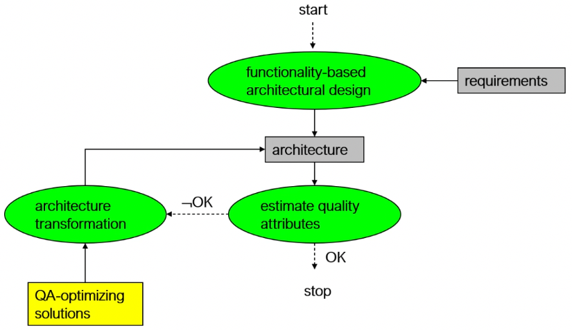
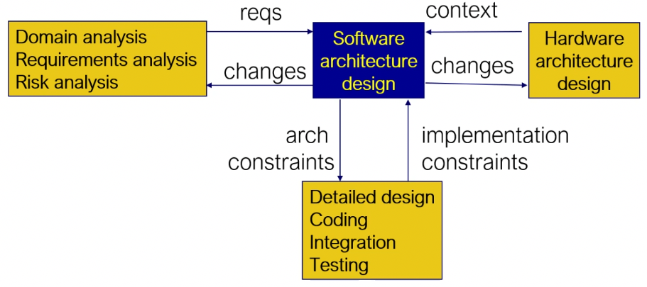
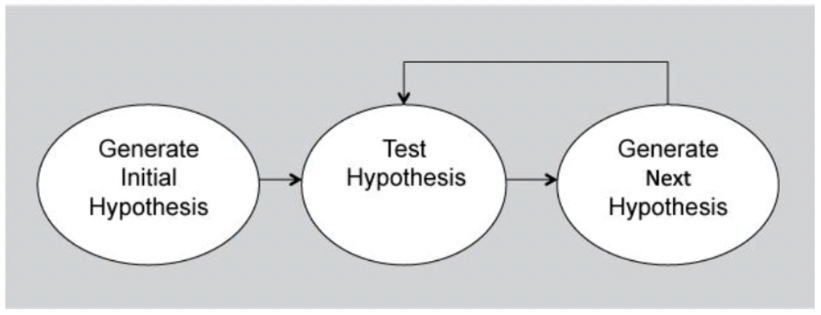
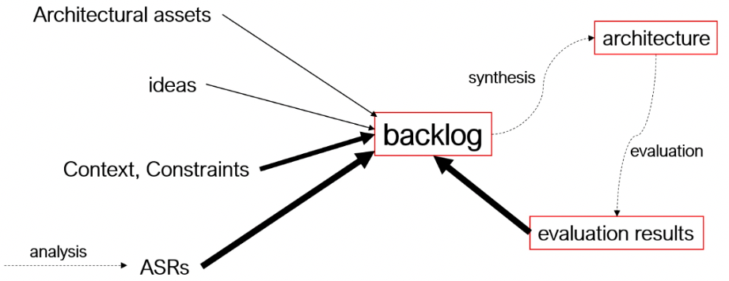
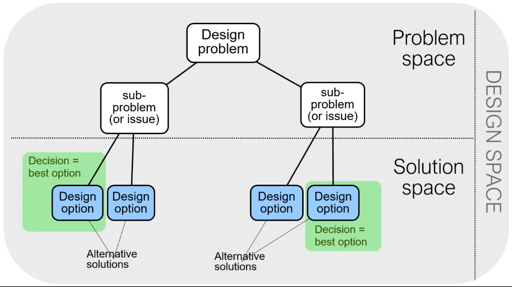

+++
title = 'Architecture design'
+++
# Architecture design
## Architecture design methods
How an architecture is developed:

Architecture design in the context of other tasks

### Attribute-driven design
1. Choose element to design
    - refinement: breadth first (figure out from high level all aspects) vs depth first (start with one aspect and go in detail)
    - choice driven by: personnel availability, risk mitigation, priorities
2. Identify ASRs (can use e.g. utility tree)
3. Generate design solution, e.g. inspired by patterns and tactics
4. Verify and prepare for next iteration
5. Repeat steps

You choose from backlog by:
- focusing on revenue
- focusing on risk:
    - identify fail scenarios (what if SHTF) and add cost×probability of fail scenarios
    - cost of decision ≈ cost to undo that decision

## Architecture design process
Design proceeds under conditions of great uncertainty: evolving requirements & limited info.
How rational are your design decisions?

Reflection-in-action: "thinking on your feet"
Reflection-on-action: retrospective reflection, thinking about what happened

Ultimate design is path through space of decisions. Choices at any point affect later (and maybe earlier) decisions.

Can we even make rational decisions?
- absolute rationality: logical chain of events+consequences, is time consuming
- bounded rationality: heuristics and rules of thumb, is time-efficient
    - decisions are made in context, which is generally selected unconsciously and automatically
    - anchoring is when you are given a set of possible choices, you stop 'thinking outside the box'
- social/cultural rationality: differences between people give new perspectives and solutions

Prospect theory & fourfold pattern:
- how people behave:
    - high probability of getting a lot: don't take the risk (fear of disappointment)
    - low probability of high loss: don't take the risk (fear of large loss)
    - high probability of high loss: risk seeking (hope to avoid loss)
    - low probability of high gain: risk seeking (hope of large gain)
- we fear losses more than we value gains
- influenced by diminishing sensitivity principle: value we perceive 'feels' different from actual worth

Design is a "wicked" problem.
There's no definite formulation, or stopping rule.
Solutions are not just true or false (I'll say this on the exam lol).
Decisions lead to new problems, to new decisions, to new problems, etc.

## Architectural decisions
Design is series of decisions:
- sub-problems of overall design problem
- each issue has several design options
- designer makes a decision to resolve each issue (involves choosing 'best' option among alternatives)

Design space:
- space of possible designs you can get by choosing different sets of alternatives
- is problem space + solution space

Technical and non-technical concerns/options are intertwined: architects decide on type of database, management decide on budget.

Types of decisions:
- implicit, undocumented (unaware, tacit, 'of course' knowledge)
- explicit, undocumented (vaporizes over time)
- explicit, explicitly undocumented (tactical, personal reasons)
    - e.g. the streets in the Jordaan area of Amsterdam are angled differently than the rest of the city, because it used to be an area for poor people, and this made it harder for poor people to go into richer neighborhoods, as well as harder for rich people to see the poor neighborhoods
- explicit, documented (preferred and exceptional situation)

Design rationale: logical reasons given to justify designed artefact
- quantitative:
    - priority: relative importance of design concern
    - cost: dev effort, maintenance effort, potential legal liabilities
    - benefit: how well an option satisfies requirements
    - implementation risk: risk that team may not do successful design
    - outcome certainty risk: risk that design may not satisfy requirements
- qualitative:
    - design assumptions
    - design constraints
    - strengths and weaknesses
    - trade-offs

Why document design decisions?
- prevents repeating past steps, which might be expensive
- explains why the architecture is good
- emphasizes qualities and criticality for requirements/goals
- provides context and background

Use of design decisions:
- identify key decisions for stakeholder
- evaluate impact for change

Template for modelling design decision:
- issue: what is it about?
- decision: which one?
- status: accepted/proposal/obsolete
- group: for grouping decisions with common characteristics
- assumptions: which are part of rationale?
- constraints: which are part of rationale?
- positions: alternatives, options to this decision
- argument: why this decision?
- implications: what are consequences of decision?
- relations: among this decision and others, or requirements/artifacts/principles
- importance: how important is this wrt quality?
- possible negative impact on quality attributes
