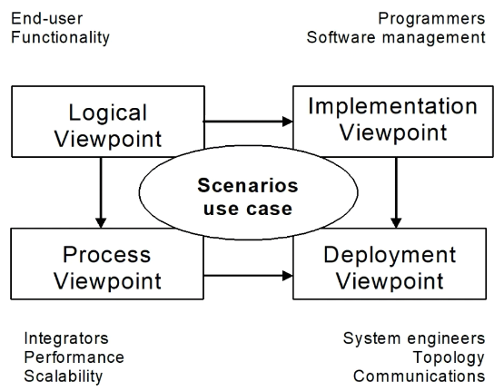
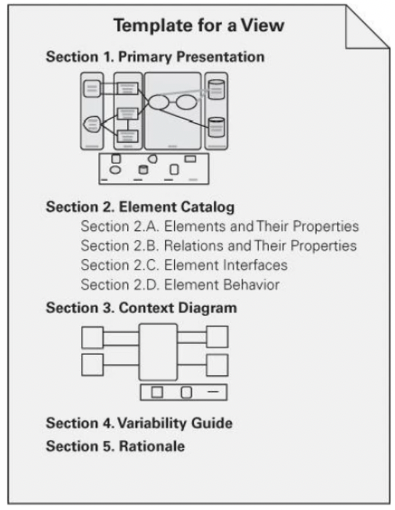

+++
title = 'Architecture representation'
+++
# Architecture representation
Analogy with the architecture of a building:
- overall picture for client
- front view for client and "fine arts" committee
- different view with water supply for plumber
- different view with electrical wiring for electrician
- etc.

Basically, there are two flavors:
- powerpoint slides, for managers/users/clients
- UML diagrams, for technicians

## ISO/IEC/IEEE standard for architecture description (ISO 42010)
Defined as architecture views and viewpoints.

System stakeholder: individual/team/organization with interest in system
View: expresses architecture of system from perspective of specific system concerns (like a map)
Viewpoints: establishes conventions for construction, interpretation, and use of architecture views to frame specific system concerns (like a legend for a map)

Viewpoint specification:
* Viewpoint name
* Stakeholders addressed
* Concerns addressed
* Language, modelling techniques (including explanation of symbols)

Viewpoints separate concerns.

## Kruchten's 4+1 view model

* Scenario viewpoint: small subset of important scenarios to show that elements of four viewpoints work together seamlessly.
    * acts as driver to help designers find architectural elements during architecture design
    * validates and illustrates architecture design on paper and as starting point for prototype tests
* Logical viewpoint: supports functional requirements (services system should provide to users), shows key abstractions
* Process viewpoint: mapping of functions to runtime elements
* Implementation viewpoint: focuses on organisation of actual software modules (incl. packaging)
* Deployment viewpoint: how various elements from above viewpoints must be mapped onto nodes

## How to decide on views
What are stakeholders and their concerns?
Which views address the concerns?
Then prioritize and maybe combine views.

## Documenting a view
* primary representation (graphical/textual)
* element catalog -- refer to every element and relation, propose a definition
* perhaps context diagram, variability guide
* rationale -- why does the view have what it has?

