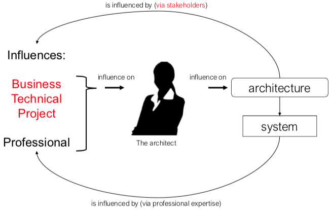

+++
title = 'Introduction'
+++

# Introduction
What is software architecture?
- fundamental concepts/properties of system in its environment
- embodied in its elements, relationships, and principles of its design/evolution
- so: design + design decisions

Why?
- vehicle for stakeholder communication
- way for manager to reason about cost and schedule
- manifests earliest set of design decisions
- transferable abstraction of system

Characteristics of Software Architecture
- Iteration on functional/quality requirements
- Many stakeholders involved
- Balancing of functional/quality requirements

Architecturally significant requirements (ASRs):
- architectures are driven by quality attribute requirements (e.g. system must be modular, shall meet users' performance expectations)
- features/functionality shape architecture to lesser extent

Business goals:
- e.g. "we want to differentiate our product from competition and capture market share)
- may directly affect architecture
- often lead to quality attribute requirements

## Architecture representations & styles
Structure: coherent set of architectural elements
View: representation of structure (picture)

Structures:
- modules: module is unit of implementation with assigned areas of functionality
- component-connector: elements with runtime behavior (components) and interactions (connectors)
- allocation: relationship between software elements and environment

Architectural style: description of component and connector types, pattern of their runtime control/data transfer

Design patterns: recurring structures of communicating components that solve general design problem in a context (e.g. Model-View-Controller)

## Architecture assessment
Assesses whether architecture meets quality goals.

Software Architecture Analysis Method (SAAM)

* develop scenarios for
    - activities system must support
    - changes anticipated
* describe architectures
* classify scenarios
    - direct: use requires no change
    - indirect: use requires change
* evaluate indirect scenarios wrt changes and cost
* reveal scenario interaction
* overall evaluation

## Architecture influence cycle

architecture affects:
- structure of developing organisation
- goals of developing organisation
- requirements for next systems

Building a system affects architect's experience

## Role of software architect
Ineffective: police agent, documentalist, isolationist (no communication with stakeholders)
Effective: key tech consultant, decision maker, coach of dev team, design coordination, implementing key parts

A good architect (1) has experience, (2) has domain knowledge, (3) _communicates_.
