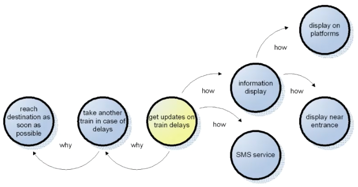
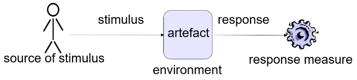
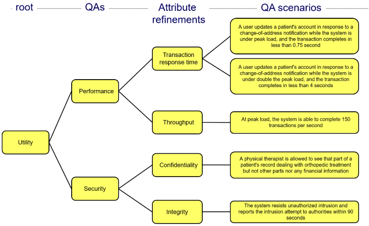
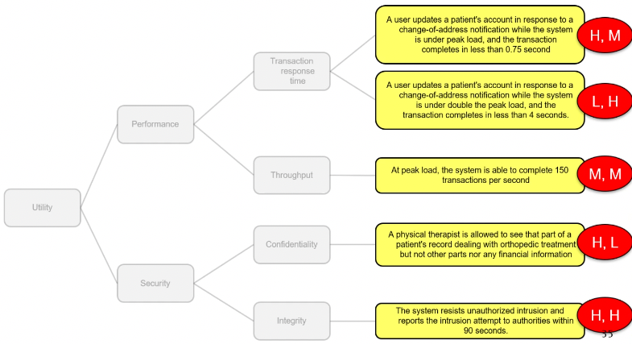

+++
title = 'Requirements'
+++
# Requirements
## Types of requirements
- Functional requirements
    - what the system must do, how to react to runtime events
    - satisfied by assigning appropriate seq of responsibilities throughout design
- Quality attribute requirements
    - qualifications of functional requirements, e.g. how fast something must be done
    - satisfied by structures designed into architecture, and behaviors/interactions of elements in those structures
- Constraints
    - design decisions where you have no freedom, e.g. using a certain programming language or reusing certain module
    - satisfied by dealing with it (in fancy language, "reconciling the design decision with other affected design decisions")

Neither functions nor quality attributes stand on their own

Two categories of quality attributes:
- development time qualities
- runtime qualities

## Architecturally significant requirements
Architectures mostly driven by quality attribute requirements, features/functionality not as much
Something like "the system must be modular" isn't enough; what's the reason? Has to be quantified and specific.

Finding ASRs:
- requirements documents (but often little info, architecture can't wait for requirements to be finished)
- interviewing stakeholders (tells you what they want, but often they have no idea, and you might get random numbers from them)
- understanding business goals (often lead to quality attribute requirements, may directly affect architecture)

## Business goals
Business goals often lead to QA requirements, may directly affect architecture.
Some may be satisfied without using the architecture (e.g. to reduce cost, stop heating the offices when everyone's working from home)

There are some standard categories, e.g. meeting financial/personal objectives, meeting responsibility to employees/society/state/shareholders, managing market position, managing change in environmental factors

Expressing business goals:

> "For {system being developed}, {goal subject} desires that {goal object} achieve {goal} (in the context of {environment}) and will be satisfied if {goal measure}."

## Requirements and goals
Goals are the "why", requirements are the "how".

## Quality attribute scenarios
Specifies quality-attribute-specific requirement.

Six parts:
1. stimulus: event arriving at system (input)
2. Source of stimulus
3. Response of system (output)
4. Response measure - how you determine that response is satisfactory
5. Environment - conditions when stimulus happens
6. Artefact - which portions of system does requirement apply to

## Capturing ASRs in utility tree
Utility as root (expression of overall 'goodness' of system).
Elaborated into QAs, decomposed into attribute refinements, expressed in ASRs (usually as QA scenarios)

For example:

Assess the ASRs in terms of business impact and architectural impact (high, medium, low):

Checks based on utility tree:
- have all QAs been refined and expressed in ASRs?
- where are the risks? (H,H) ratings
- are all concerns addressed?

## Usability
How easy it is for user to accomplish tasks, what support system provides for user.

Dimensions:
- learning features
- using it efficiently
- minimizing impact of errors
- adapting to user's needs
- increasing confidence and satisfaction
