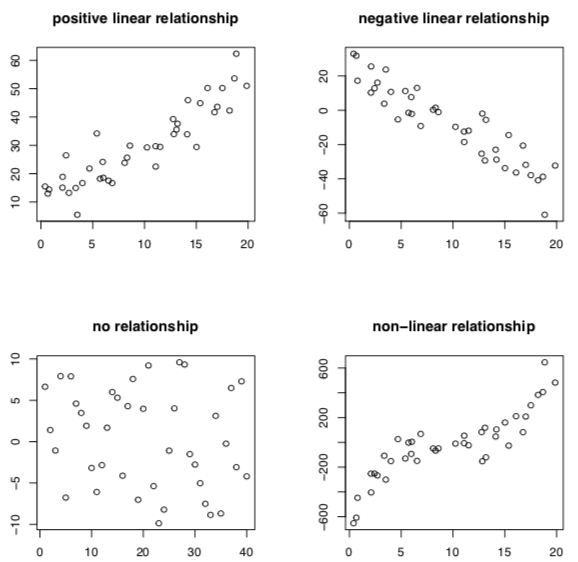
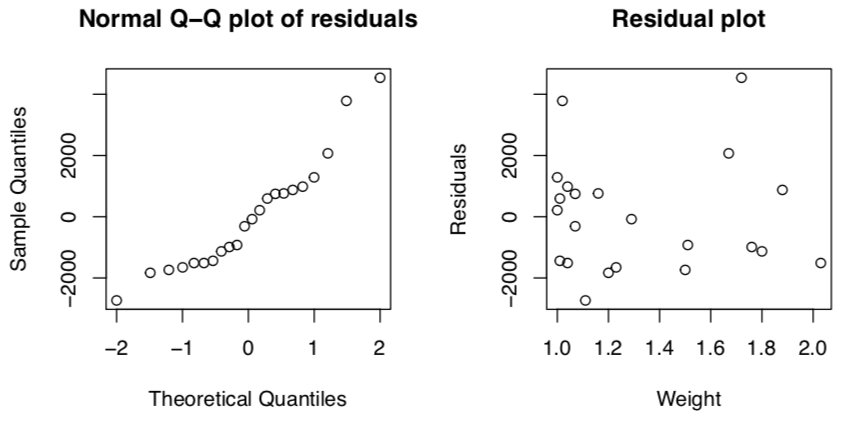

+++
title = 'Relationships between variables'
template = 'page-math.html'
+++

# Relationships between variables

relationship can be investigated, causality can’t.
graphically, you can use scatterplots:

## Correlation

correlation: if values of two variables are somehow associated with each other

- positive: higher values of variable 1 are usually associated with higher values of variable 2
- negative: higher values of variable 1 are usually associated with lower values of variable 2

linear if the plotted points are basically a straight line.
population linear correlation coefficient is ρ.
sample linear correlation coefficient (estimator for ρhoρ) is:

$r = \frac{1}{n-1} \times \frac{\sum_{i=1} n(x_{i} - \bar{x})(y_{i} - \bar{y})}{s_{x} s_{y}}$

interpreting r:

- r = 1: perfect positive linear relationship
- r >0: positive linear relationship
- r ≈ 0: no linear relationship (doesn’t mean no relationship!!)
- r < 0: negative linear relationship
- r = −1: perfect negative linear relationship

### Testing ρ = 0

test statistic:

$T_{p} = \frac{R - \rho}{\sqrt{\frac{1 - R^{2}}{n-1}}}$

has under H0: ρ = 0 a t-distribution with n−2 degrees of freedom.

## Regression

if there’s a correlation, points can be described by line 
$y_{i} = \beta_{0} + \beta_{1} x_{i} + error_{i}$

regression equation is $\hat{y} = b_{0} + b_{1} x$

where b₀ and b₁ are least-squares estimates of β₀ and β₁

you want values that satisfy least-squares property (i.e. minimise $\sum_{i} (observed - model)^{2}$)

$\begin{aligned}
b_{1} &= r \frac{s_{y}}{s_{x}} &&\text{(the slope)} \\\\
b_0 &= \hat{y} - b_{1} \bar{x} &&\text{(the y intercept)}
\end{aligned}$

### Testing linearity

Test:
- H0: β1 = 0
- HA: β1 ≠ 0

The score is:

$t_{\beta} = \frac{b_{1}}{s_{b_{1}}}$

(realisation of test statistic $T_{\beta}$ that has t-distribution with n−2 degrees of freedom under H₀)

### Coefficient of determination

Coefficient of determination is proportion of variation in y variable that regression equation can explain:

$r^{2} = \frac{\text{explained variations}}{\text{total variation}}$

### Residuals

To check for a fixed standard deviation, make a residual plot.
Residuals are estimates for the errors.

residual: difference between observed yi and predicted value $\hat{y}\_{i} = b\_{0} + b\_{1} x\_{i}$

$residual\_{i} = y\_{i} - \hat{y}\_{i} = y\_{i} - (b\_{0} + b\_{1} x\_{i})$

A residual plot is scatterplot of residuals against x values. Should be no obvious pattern in residuals.

