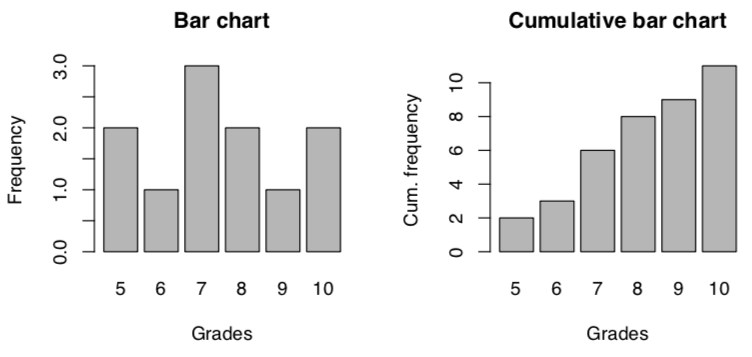
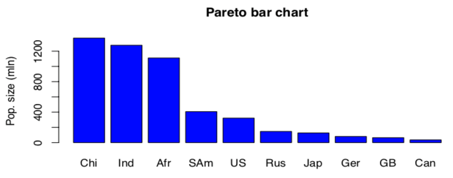
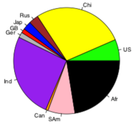
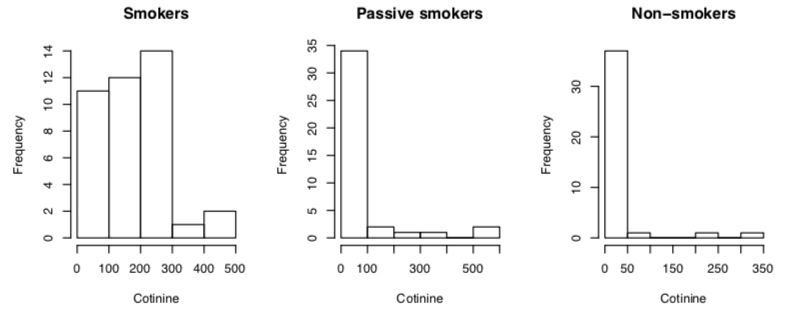
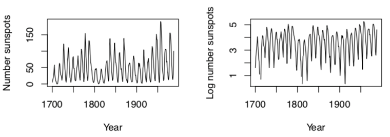
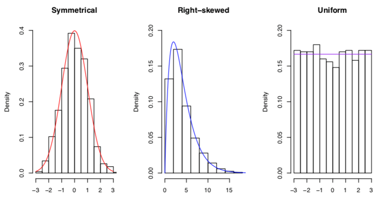
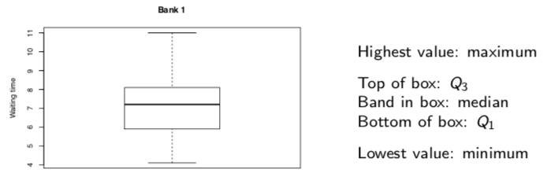

+++
title = 'Summarising data'
template = 'page-math.html'
+++

# Summarising data

**data distribution:** we want to know what the data looks like

a good summary needs to show location, spread, range, extremes, gaps/holes, symmetry, etc.

## Graphical summaries

### Frequency distribution (table)

| Grade | Frequency |
| --- | --- |
| 5   | 2   |
| 6   | 1   |
| 7   | 3   |
| 8   | 2   |
| 9   | 1   |
| 10  | 2   |

### Bar chart

### Pareto bar chart
orders categories based on frequency. only for nominal level of measurement

### Pie chart
size of pieces of pie shows frequency of category.

### Histogram
size of bar shows frequency of that category.

### Time series
shows quantity that varies over time.

## Descriptive summaries
qualitative description:

- shape:

    

- location: position on x axis (around 0, around 10, etc.)
- dispersion: spread out graph == large dispersion

numerical description:

- location: measure of center
    - mean: average (sum everything, divide by the total number)
    - median: sort, find the middle number
    - mode: most often occurring value (highest frequency)
        - unimodal: unique mode
        - bimodal: two modes
        - multimodal: more than two modes
- dispersion:
    - measures of variation
        - sample standard deviation (how much values deviate from mean)
            - same units as data (unlike variance)
            - standard deviation is $\sqrt{s^{2}}$
            - $s^{2} = \frac{\sum_{i=1} n(x_{i} - \bar{x}^{2})}{n-1}$
            - for population: σ², σ
        - range
            - (minimum - maximum)
            - sensitive to extreme values
    - relative standing
        - percentiles, quartiles (special percentiles: Q1, Q2 (median), Q3)
        - IQR: interquartile range = (Q3 - Q1)
        - 5-number summary: min, Q1, median (Q2), Q3, max
            - boxplot is graph of this
            - whiskers are lines from box (by default, not more than 1.5 × IQR
            - outliers: points outside of whiskers

