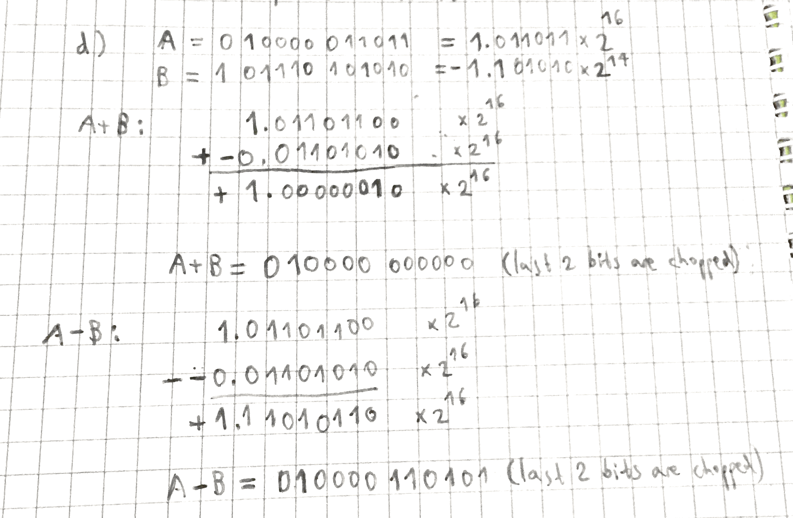

+++
title = 'Adding/subtracting floating point values'
+++
# Adding/subtracting floating point values
1. Choose a number with the smaller exponent and move its mantissa right to make the exponents equal.
2. Exponent of the result is the same as the larger exponent.
3. Add/subtract the mantissas, determine sign of the result.
4. Normalise the resulting values.

Example:

