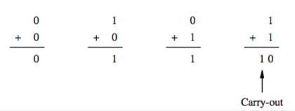
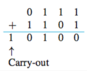

+++
title = 'Addition & subtraction with signed integers'
+++
# Addition & subtraction with signed integers
Just like with base-10 numbers, but you carry if you have more than the binary version of 1.

To add (2’s complement): add bitwise, ignoring the leftmost carry-out.

To subtract (2’s complement): for X-Y, form 2’s complement of Y and then add.

 

An overflow happens when both terms have the same sign and the result has a different sign.

In 1’s complement, the carry-out can’t be ignored — if it’s 0, the result is correct; if it’s 1, a 1 has to be added to the result.

You can stick the same value into more bits by repeating the leftmost digit.
