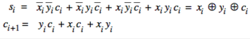
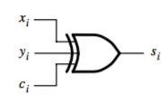
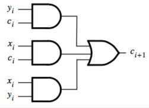
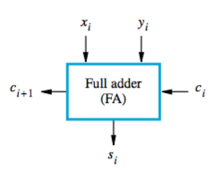
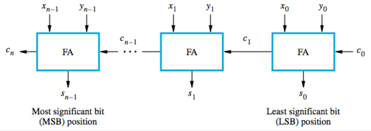
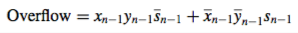
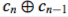

+++
title = 'Addition/subtraction logic unit'
template = 'page-math.html'
+++
# Addition/subtraction logic unit
## Adders
A half adder takes two inputs, produces sum and carry-out.

A full adder also takes a carry-in.

You can easily get this from a truth table:

You can make a circuit out of this. Inputs are x, y, and carry. Carry out is $c_{i+1}$:

|   Sum  | Carry    |
| --- | --- |
|  |  |

That’s represented by the symbol:

If you want to add n bits, you stick a bunch of them together and make an *n*-bit ripple-carry adder. $x_{n-1}$ and $y_{n-1}$ are the sign bits:

## Detecting overflow
Remember that the final carry out is not a part of the result.
It’s an overflow when:

- the sign of the sum is different from the sign of the summands
- or the carry-out bits are different

Two logical expressions for detecting overflow (either works):

