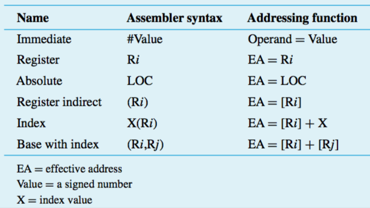

+++
title = 'Addressing modes'
+++
# Addressing modes
addressing modes: ways of specifying locations of instruction operands

Summary of RISC-type addressing modes:

## Modes
Provide operand/address explicitly:

- Register — operand is contents of processor register, name of register is given in instruction
- Absolute — operand is in memory location, address of location is given in instruction
- Immediate — operand is given explicitly in instruction (use `#`or `$`to indicate that it is an immediate operand)

Provide information from effective address:

- Indirect — effective address of operand is in register, register is given in instruction (pointer-type). use parentheses `()`
- Index — effective address of operand is generated by adding a constant to contents of register

when specifying an offset in index, the offset can be either positive or negative. means the number of bytes to move.
