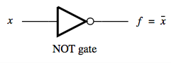
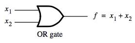
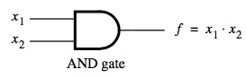
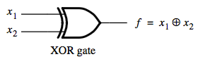
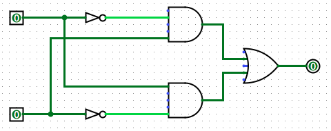

+++
title = 'Basic logic gates'
+++
# Basic logic gates
Logic gates are transistor-based components. Here are the four basic ones.

## NOT (complement)

for a variable x,
x̄ = 1-x
∴ x + x̄ = 1

## OR (union)
OR function (+) has value 1 if any of inputs has value 1.

Properties:
- 1 + x = 1
- 0 + x = x

## AND (intersection)
AND function (⋅) has value 1 if all inputs have value 1.

NOTE: the operator ‘⋅’ is often omitted!

Properties:
- x₁ ⋅ x₂ = x₂ ⋅ x₁
- 1 ⋅ x = x

## XOR (exclusive or)
XOR function (⨁) has value 1 if one of inputs has value 1.

- x₁ ⨁ x₂ = x₂ ⨁ x₁
- 1 ⨁ x = x̄
- 0 ⨁ x = x

How an XOR gate is built and functions:

