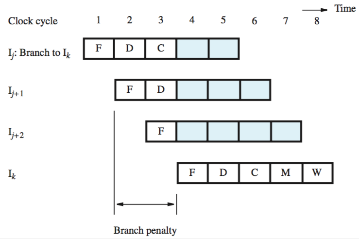
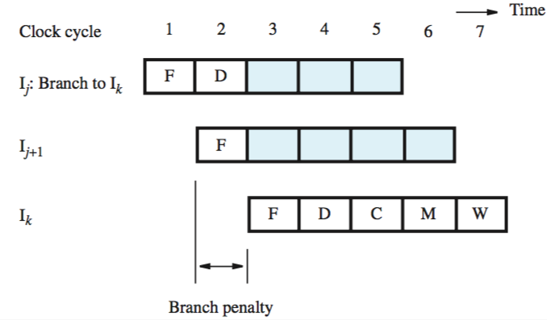
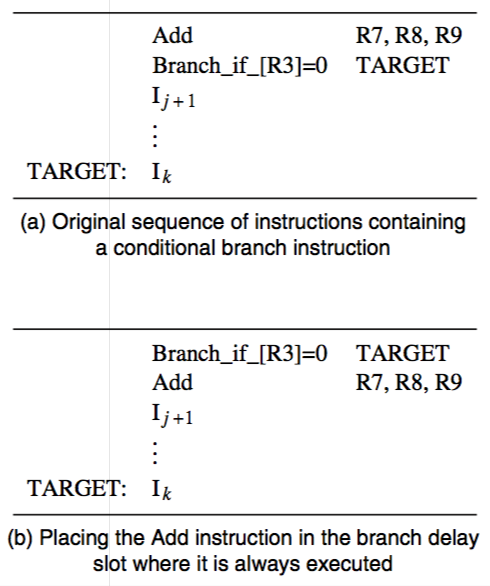

+++
title = 'Branch delays'
+++
# Branch delays
## Unconditional branches

the two instructions that are fetched during decode and compute of first instruction (a branch) have to be discarded

this two cycle-delay — “branch penalty”

to reduce the penalty, branch target address must be computed earlier than pipeline — in the decode stage

this reduces the penalty to one cycle:

this needs hardware modification — PC has to be incremented in every cycle, and a second adder is needed in decode stage to compute branch target address for every instruction

## Conditional branches
branch condition must be tested as early as possible
comparator to test condition can be moved to decode stage
it would use values from register file outputs A and B directly

## Branch delay slot — compiler reorganises instructions
branch delays slot — the location that follows a branch instruction

compiler tries to find an instruction that it always executed, independent of whether or not the program branches

data dependencies must be preserved
if the compiler can find a useful instruction, there’s no branch penalty
otherwise, it NOPs out and there’s a penalty of one cycle

## Branch prediction
Static:

- assume branch will not be taken, fetch next instruction in sequential order
- simple, decent accuracy
- processor can determine static prediction by checking sign of branch offset
- other option — encoding of branch instruction can include a bit indicating whether prediction should be ‘take’ or ‘not taken’ (set by compiler)

Dynamic:

- use actual branch behaviour
- processor assumes that next time an instruction is executed, branch decision is likely to be the same as last time
- keep more information about execution history, such as four states (strongly taken, likely taken, likely not taken, strongly not taken)
- keep a branch target buffer
    - identifies branch instructions by their addresses
    - in the form of lookup table
    - contains: address of branch instruction, one/two state bits for branch prediction algorithm (outcome), branch target address
