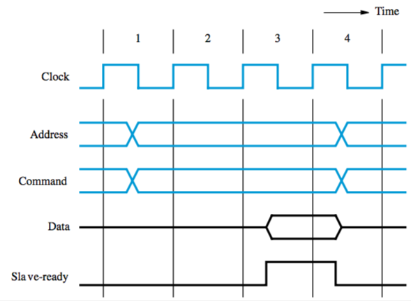
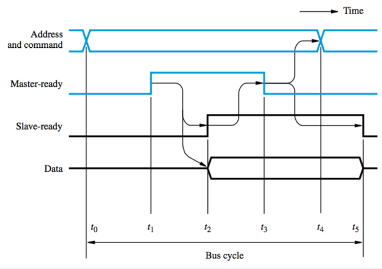

+++
title = 'Buses'
+++
# Buses
## Bus Structure

bus — commonly used interconnection network between processor, memory, and I/O devices

three sets of lines (wires) to carry address, data, and control signals

- address lines — processor places address on it, decoders of all devices on the bus analyse it, the one that recognises the address responds to commands on control line
- control lines — used by processor to request read/write
- data lines — used for transferring requested data

when processor places address on address line, decoders of all devices on the bus analyse it

the device that recognises the address responds to the commands on the control lines

## Bus operation
bus protocol — set of rules governing how it’s used by various devices

rules are implemented by control signals

e.g. a R/W̄ control line — read when 1, write when 0

if multiple devices request to access the bus, the decision is made by an arbiter circuit

Synchronous bus: all devices get timing info from bus clock control line

- simple, but it’s got problems
- transfer has to be done in one clock cycle, so clock period has to accommodate slowest component
- processor can’t determine whether device actually responded
- so many designs include control signals representing a response from a device

Asynchronous bus: based on use of a handshake protocol between master and slave (exchange of command and response signals)

