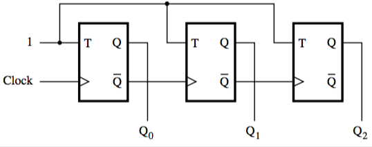

+++
title = 'Counters'
+++
# Counters
## 3-bit counter (asynchronous)
below is a counter made with T flip-flops.
when T is 1, the value changes with each tick.

Changing from 0 to 1 to 0 takes 2 ticks. This means that Q₀ has a frequency half of the clock, Q₁ a frequency half of Q₀, etc.

This means we can make a ripple counter.

