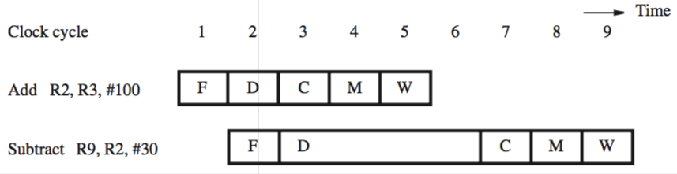
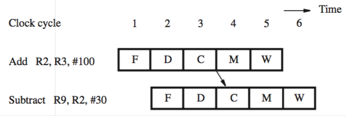
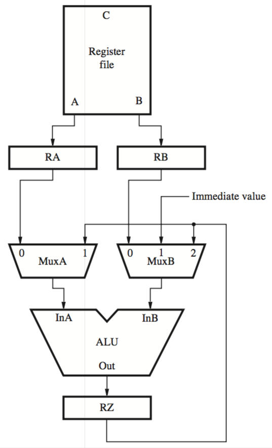

+++
title = 'Data dependencies'
+++
# Data dependencies
instructions:
- Add R2, R3, #100
- Subtract R9, R2, #30

R2 is destination for add, and source for subtract

there is a data dependency between the instructions

subtract has to be stalled, like this:

1. Control circuit recognises data dependency when it decodes subtract instruction (compare source/destination registers)

2. Subtract instruction is held in interstage buffer B1 during cycles 3-5

3. Add instruction proceeds, signals are set in interstage buffer B2 for implicit NOP (no operation) instruction — creates a ‘bubble’ (clock cycle of idle time)

the stalls can be alleviated using operand forwarding:

- in the above example, value is available at the end of cycle 3
- hardware implementation
    - hardware can forward the value from RZ to where it’s needed
    - modification of datapath needed (new multiplexer)
- software implementation
    - compiler can identify dependencies and insert NOPs
    - does not decrease time, increases code size
    - but hardware isn’t as complicated

the result of hardware implementation looks like this:

The new datapath, incorporating operand forwarding:

