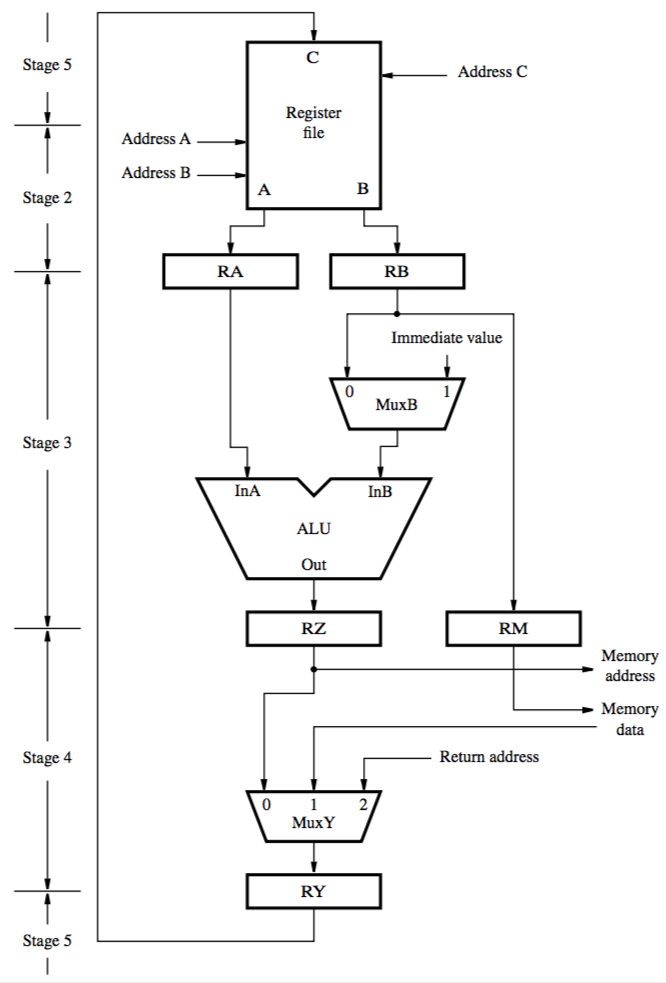
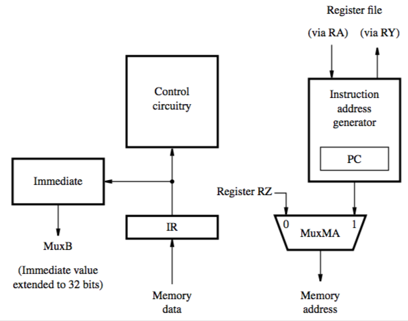

+++
title = 'Data path & instructions'
+++
# Data path & instructions
## Overall data path:
organised in five stages, according to steps executed
1. Instruction fetch
2. Load from source registers
3. ALU computes
4. Memory access
5. Save to destination register

## Instruction fetch section
address for memory access come from PC for instructions, from RZ for operands
instruction address generator (includes PC) updates contents of PC after fetch
instruction loaded into IR, examined by control circuitry to generate signals
immediate values are sign-extended to 32 bits

## Instruction fetch & execution in steps
with an example instruction: ADD R3, R4, R5

1. Fetch instruction and place in IR
2. Contents of R4, R5 move to RA, RB
3. Control circuitry sets MuxB to input 0 (RB), causes ALU to add RA+RB into RZ

4. MuxY selects input 0, RZ moves to RY. Control circuitry connects destination address to input for port C of register file

5. Write RY to R3

## Waiting for memory

when requested info isn’t in cache and has to be fetched from main memory, multiple clock cycles may be needed

processor-memory interface circuit generates a Memory Function Completed (MFC) signal

if the data is in cache, MFC signal is asserted before the end of the clock cycle

## How are control signals generated?
either hardwired or microprogrammed control

hardwired — setting of signals depends on:

- contents of step counter
- contents of instruction register
- results of computation/comparison
- external input signals (e.g. interrupts)
