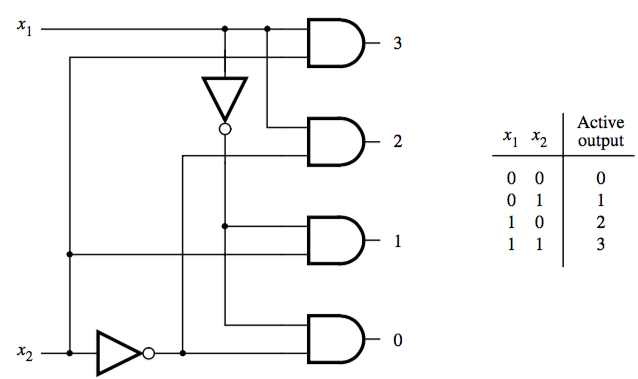

+++
title = 'Decoders'
+++
# Decoders
a circuit capable of accepting a n-variable input and generating corresponding signal on one out of 2ⁿ outputs

select one output based on the inputs, and give it a value of 1

