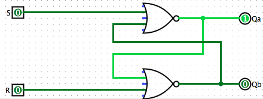
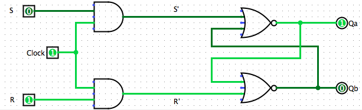
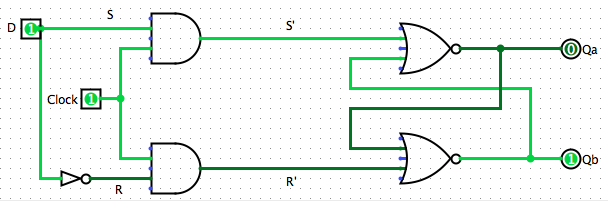
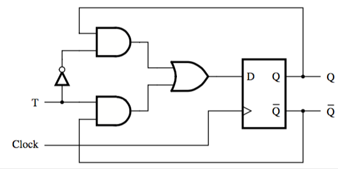
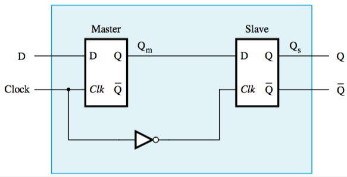

+++
title = 'Flip-flops'
+++
# Flip-flops
## SR Latch

Circuit of two NOR gates that can ‘remember’ which input was most recently 1 (in this case, R).

The state R = S = 0 is undefined, the state R = S = 1 is unused.

## Gated SR Latch

When the time at which to set or reset is controlled by a clock instead of the inputs

When the clock is at 1, signals R’ and S’ change based on R and S.
When the clock is at 0, no change in the state can happen.

Implementation with NAND gates? Just replace every gate with a NAND. It works. Trust me, I’m a computer scientist.

## Gated D latch

Instead of using two separate inputs, you can derive the inputs from one input, D (data):

## T flip-flop
changes state every clock cycle if its input T is 1 — "toggles state"

## Master-slave flip-flop

What if you don’t want a change in the input to be immediately propagated to the output?

Connect two gated D latches to create a master-slave flip-flop.

While clock is 1, master is affected by changes in D but slave stays in the same state.

When clock changes from 1 to 0, output is propagated to the slave.

