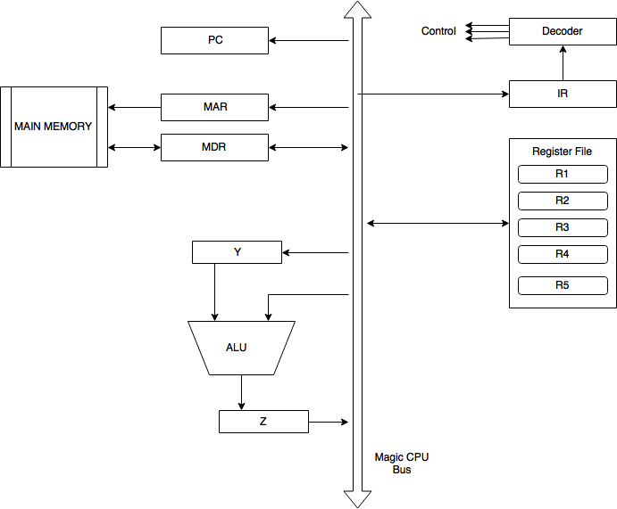
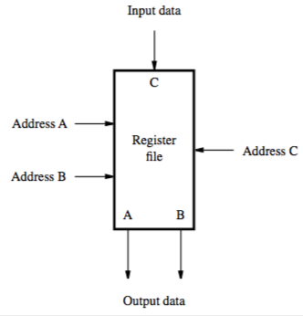
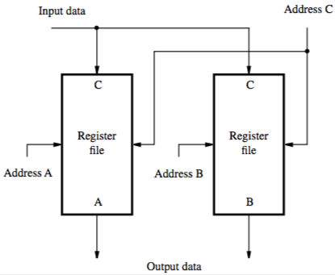
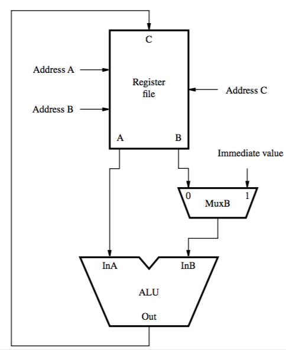

+++
title = 'Hardware components'
+++
# Hardware components
## Von Neumann Architecture

## Organisation of the Central Processing Unit (CPU)

## Register file
small and fast memory block, array of storage elements

circuitry that enables data to be read from or written to any register

access circuitry:

- read
    - enables two registers to be read at the same time
    - has two address inputs to select registers to be read
    - dual-ported: contents of two registers is available via two separate outputs A and B (ports)
- write
    - data input C and corresponding address input for read

how to realise dual-ported memory units:

| Single memory block | Two memory blocks |
| --- | --- |
|  |  |

## ALU
used to manipulate data, performs add/subtract and logic (AND, OR, XOR)

two inputs — one from register out A, one from multiplexer

multiplexer either selects register out B, or immediate value in IR

output is connected to data input of registers

