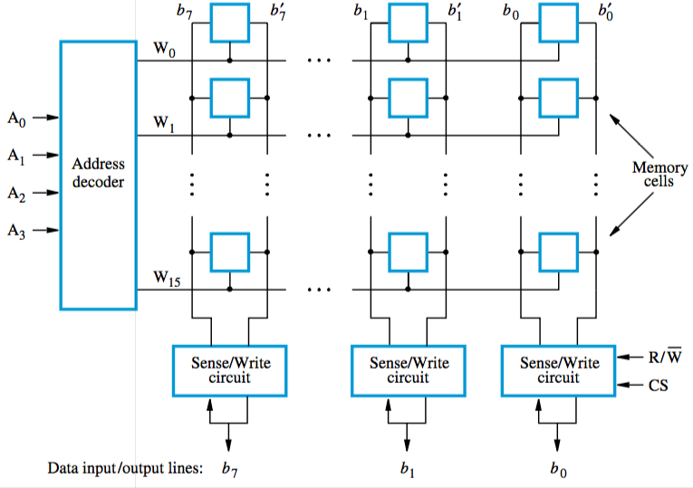
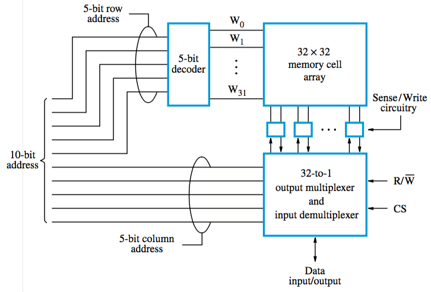

+++
title = 'Internal organisation of memory chips'
+++
# Internal organisation of memory chips
organised in form of array, one cell stores one bit of info

each row constitutes a memory word, all cells of a row are connected to a common line (‘word line’)

each column is connected to a Sense/Write circuit by two bit lines

an example of 16 x 8 organisation (16 words, 8 bits each):

a second way of organising is, for example, a 1024 memory cell circuit organised in a 1K x 1 format (1000 words, 1 bit each):

