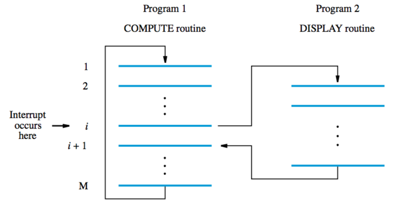

+++
title = 'Interrupts'
+++
# Interrupts
if the program was just waiting for a signal from an I/O device it would be an insane waste of time. that’s why they invented interrupts.

interrupt request — hardware signal sent by I/O device

after a processor receives this signal, it responds through an interrupt-service routine

after interrupt-service routine is done, an interrupt acknowledge signal is sent to the device

interrupts can be enabled/disabled by setting the IE bit of the status register PS

btw, also used in exceptions and debugging!

Example execution:

1. Device raises an interrupt request, interrupt request arrives during execution of instruction *i*

2. Processor completes execution of instruction *i*
3. Saves contents of PC (counter) and PS (status)
4. Interrupts are disabled by setting IE bit of PS to 0

5. Processor loads PC with address of first instruction of interrupt-service routine, routine is executed

6. After execution, PC and PS are restored (including setting IE bit to 1)
7. Processor continues from instruction *i*+1

## Multiple devices
organised in a priority structure

priority level of processor is priority of program that is being executed

only interrupts from higher priorities than the processor's are accepted

option 1 — polling

- poll all devices
- the first to set the IRQ bit of PS to 1 is serviced

option 2 — vectored interrupts

- allocate area in memory to hold addresses of interrupt-service routines (interrupt vectors)
- each device identifies itself on request
- the info provided by requesting device is a pointer into the interrupt-vector table
