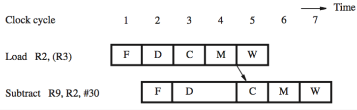

+++
title = 'Memory delays'
+++
# Memory delays
another cause of pipeline stalls is a delay from memory access

for example, because of a cache miss

instructions:
- Load R2, (R3)
- Subtract R9, R2, #30

even if data for load is found in cache, operand forwarding can’t be done the same way — data read from cache are not available until they are in RY at start of cycle 5

subtract must be stalled for one cycle to delay ALU operation

eliminating the one-cycle stall:

- compiler inserts a useful instruction between load and memory-dependent instruction
- otherwise, hardware stalls automatically (or compiler inserts NOP)
