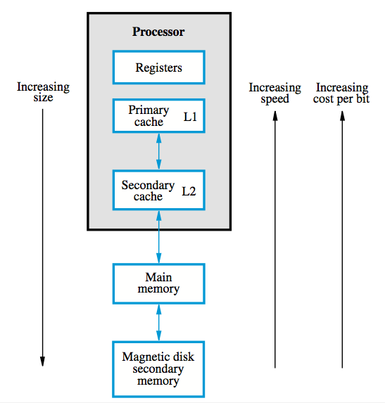

+++
title = 'Memory hierarchy'
+++
# Memory hierarchy
static RAM is fast, but larger cells with higher power consumption

DRAM is reasonable cost, but affordable size is still too small

Disks are reasonable cost, but much slower

therefore, combine!

memory hierarchy:

