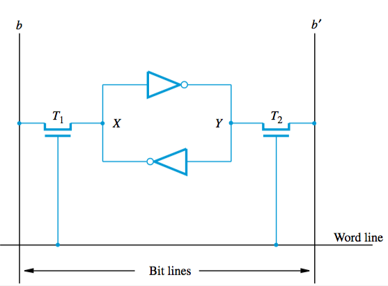
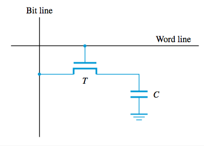
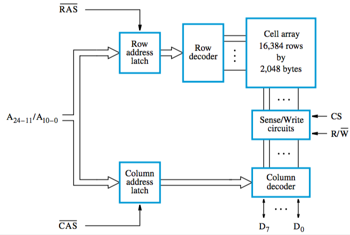

+++
title = 'Memory types'
+++
# Memory types
## Static memories (SRAM)
circuits that can retain state as long as power is applied

fast, but cells require several transistors

one cell has two inverters that are cross-connected — a latch

Read operation

- word line is activated, closes switches T1 and T2.
- If cell in state 1, signal on b is high and signal on line b’ is low. Vice versa.

Write operation

- sense/write circuit drives bit lines b and b’
- places appropriate value on line b and its complement on b’, activates word line
- forces cell into corresponding state, retains when word line is deactivated

## Dynamic memories (DRAM)
do not retain state for a long period unless accessed frequently

info is stored in form of charge on a capacitor (only for tens of milliseconds)

contents are periodically refreshed when they are accessed/written to

example of single transistor-capacitor DRAM cell:

A full 32M x 8 chip:

Refresh (and read) operation:
- transistor in selected cell is turned on
- sense amplifier on bit line checks if charge in capacitor is above threshold value
- if above, sense amplifier drives bit line to full voltage (1)
- otherwise, pulls bit line to ground level

Fast page mode:
- each sense amplifier is also used as latch
- so when a row address is applied, contents of all cells in the row are loaded into latches
- so all bytes in the row can be transferred sequentially, increasing block transfer speed.

## Synchronous DRAMs
operation is synced with a clock signal

built-in refresh circuitry with a refresh counter to refresh specific rows

## Double-Data-Rate SDRAM

large number of bits are accessed at the same time when a row address is applied

data are transferred both on rising and falling edges of clock

## Rambus Memory
proprietary

uses fewer wires with a higher clock speed

makes use of differential-signaling technique to transfer data

signals are transmitted using small voltage swings of ±0.1V around reference value
