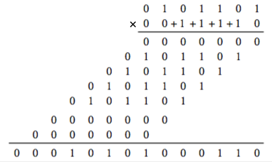
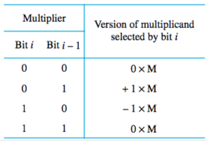
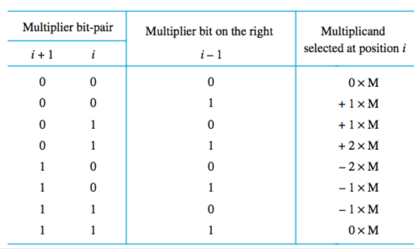
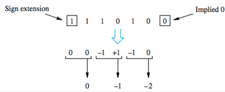
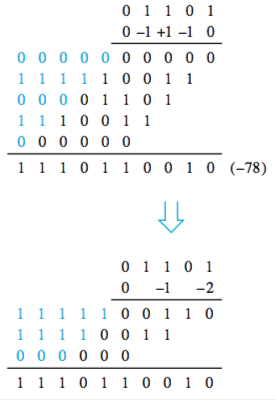

+++
title = 'Multiplication of signed integers'
+++
# Multiplication of signed integers
Meaning 2’s complement signed ints.
There’s the shorthand and then there’s the algorithm.

## Shorthand (same as decimal multiplication)



## Booth’s algorithm:
Involves recoding the multiplier (Y in “X times Y”) based on this table, going bitwise left to right.

If the last bit is a 1, there’s an implied 0 behind it.



Then you do a table, going bitwise right to left on recoded multiplier. If it’s zero, you shift. If it’s -1, you add -A and shift. If it’s +1, you add A and shift.

For example, if given 001111 × 001111:

```
A = 001111
B = 001111
-A = 110001
```

Recoded multiplier (B): `0 +1 0 0 0 -1`

| Product | Step description | Multiplier bit |
| --- | --- | --- |
| 000000 | Initialise | -   |
| 110001 | Add -A | -1  |
| 1110001 | Shift |     |
| 11110001 | Shift only | 0   |
| 111110001 | Shift only | 0   |
| 1111110001 | Shift only | 0   |
| 0011100001 | Add +A | +1  |
| 00011100001 | Shift |     |
| 000011100001 | Shift only | 0   |

So the final result is `000011100001` (twice as many bits as the terms).

## Speeding up the process
Bit-pair recoding of multipliers using Booth recoding:



For example, for the multiplier `111010`:



To multiply by -1, make 2’s complement. To multiply by -2, add 2’s complement. So now the process is:



You could also do carry-save addition, which is a crazy-ass circuit where the carries are introduced into the next row at the correct weighted positions.

Then there’s 3-2 reducer addition: carry-save add summands in groups of 3 to get S and C vectors, group S and C vectors in 3s and carry-save add, etc. until there are only two vectors left. Those are added by carry-save.

Also, 4-2 reducer addition:

- s, c, and cout represent arithmetic sum of five inputs
- output s is the sum variable (XOR of five inputs)
- cout is independent of cin, only function of four inputs.
- steps:

    1. cout is 1 when two or more inputs  are 1
    2. other carry (c) is determined to satisfy arithmetic condition
