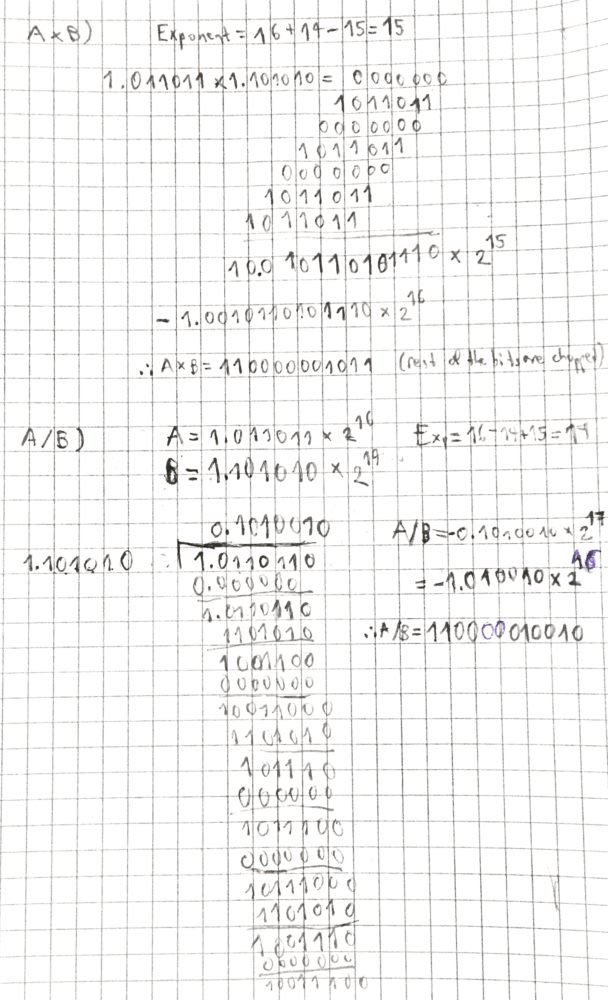

+++
title = 'Multiplying/dividing floats'
+++
# Multiplying/dividing floats
Multiply:
1. Add exponents, subtract 127.
2. Multiply mantissas and determine sign of the result.
3. Normalise resulting value if necessary.

Divide:
1. Subtract exponents, add 127.
2. Divide mantissas, determine sign of the result.
3. Normalise resulting value if necessary.

Example:

