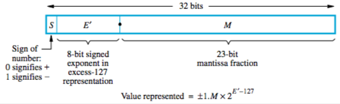

+++
title = 'Numeric representation of data types'
+++
# Numeric representation of data types
Everything’s stored in binary. Obviously. This is computers.

## Signed Integers
Representing both positive and negative numbers.

Leftmost bit (MSB) tells state of sign flag — 0 for positive and 1 for negative

Systems:

- Sign-and-magnitude
    - negative values are represented by changing MSB
    - two representations for 0 — ±0
- 1’s-complement
    - negative values are bitwise complement of positive
    - for n-bit, equivalent to subtracting number from 2n-1
    - two representations for 0 — ±0
- 2’s-complement
    - 1’s-complement; then add 1
    - in other words: for n-bit, subtract number from 2n
    - one representation for 0
    - can represent -8 in 4 bits

[Arithmetic operations with signed integers.](../addition-subtraction-with-signed-integers)

[How to design an actual circuit for this shit.](../addition-subtraction-logic-unit)

[Multiplication of signed integers](../multiplication-of-signed-integers).

Division is a pain in the ass, exactly the same as decimal long division. Just with 1s and 0s.

## Floats

Useful website: [https://float.exposed/](https://float.exposed)

float in binary: sign for number, significant bits, signed scale factor exponent for implied base 2

IEEE standard (32 bit floats) — sign bit, 8-bit signed exponent in excess-127, 23-bit mantissa (fractional)

The value stored in exponent is unsigned int E’ = E + 127 (excess-127).
E being unsigned int representation, E’ being excess 127.

Why excess-127? In 32 bits, you have 8 bits for the exponent. With 8 bits, you can represent values 0 to 255. But we want really small numbers, so a negative exponent. So the dudes at IEEE decided to go for -127 to +128. -127 (0) represents 0, 128 (255) represents infinity. So real range is -126 to +127. But the value in the exponent is an unsigned int, from 0 to 255, so the whole thing has to be shifted. Just define 0 to be -127 and you’re done. In other words, if you put a 0 in the exponent, you’re actually representing -127.

Confusing as shit. Basically if you want to write some value, you have to put that value + 127 in the exponent, in binary.

To convert to excess-127:

- convert in front of decimal point to binary (divide by 2 until no remainder, bits are in bottom-to-top order)
- convert after decimal point to binary (multiply by 2, left of decimal is next fractional 0 or 1, repeat with right of decimal)
- normalise it so that it’s of the format “1.M”, note the exponent E
- add 127 to E to form E’
- *M* is mantissa, E’ is exponent

The number is normalised if it’s in the form “1.something × 2ⁿ”.

Special values of mantissa:

- exponent all 0, mantissa all 0 — 0
- exponent all 1, mantissa all 0 — ±Infinity
- exponent all 0, mantissa not 0 — denormalised numbers (implied 0 instead of 1)
- exponent all 1, mantissa not 0 — Not a Number

All operations use guard bits to keep accuracy. However, to store, you need to remove guard bits (truncate).

Methods:

- chopping — literally just slice off any extra bits
- von Neumann rounding — if the ones you remove are all 0, you chop them. but if any of them are 1, the LSB of the retained bits is set to 1.
- rounding — 1 added to value at LSB of retained if MSB of removed bits is 1. this rounds to an even number.

[Adding/subtracting floating point values](../adding-subtracting-floating-point-values).

[Multiplying/dividing floating point values.](../multiplying-dividing-floats)

## Booleans
- false — 00000000
- true — literally anything else. often, 1 is used.

## Characters

Common encoding is ASCII. Characters are represented by 7-bit codes. Alphabetic and numeric characters are in increasing sequential order.

Unicode has a large set of international alphabets, with variable width encoding (1-4 bytes, ASCII to Latin/Greek/Cyrillic/Coptic to Chinese/Hindi/tagalog to whatever else)
