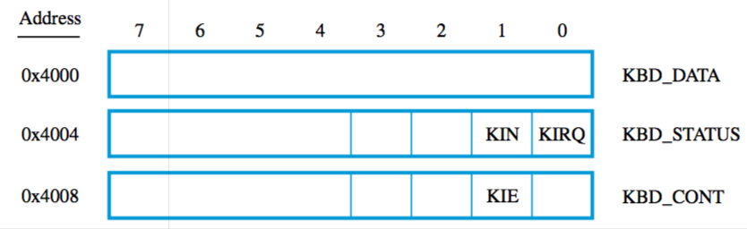
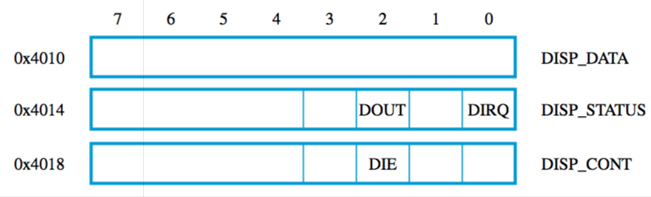

+++
title = 'Program-controlled I/O'
+++
# Program-controlled I/O
“a program that performs all functions needed to realise the desired action”

difference in speed between processor and I/O devices, need to synchronise transfer of data

solution — signalling protocol (wait for signal from device, a status flag)

polling — checking the device’s status flag

## Example: RISC-style I/O
reads from keyboard, echoes back to display. end on newline

1. Point register R2 to address of first location in main memory where read characters will be stored

2. Load newline character (terminator) into R3
3. Start input loop
    1. Move keyboard status into R4
    2. R4 = R4 AND #2
        - the KIN status flag is the second byte of the value in R4 — so R4 looks like `...0X` or `...1X`
        - #2 is 10 in binary
        - ANDing them together gives you the state of the KIN flag (i.e. 0X AND 10 = 0X)

    3. If [R4] is 0 (KIN is false), jump to step 1 of loop
4. Load `KBD_DATA` byte into R5 (clearing KIN to 0)
5. Store R5 into address in R2
6. Increment pointer in R2 (to store next character)
7. Start output loop
    1. Load `DISP_STATUS` byte into R4
    2. R4 = R4 AND #2

        - the DOUT flag is the third byte of the value in R4 — so R4 is either …0XX or …1XX
        - #4 is 100 in binary
        - ANDing them together gives you the state of the DOUT flag (i.e. 0XX AND 100 = 0XX)

    3. If [R4] is 0, jump to step 1 of loop
8. Store byte in R5 into `DISP_DATA`
9. If the Terminator isn’t in R5 ([R5] ≠ [R3]), jump to step 3 (input loop)

