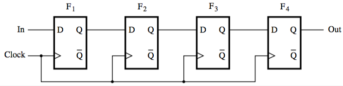

+++
title = 'Registers and Shift Registers'
+++
# Registers and Shift Registers
A flip-flop stores one bit, a register can store many in multiple flip flops.

A register is just a bunch of flip-flops put together, the operation of which is synced by a common clock.

## 4-bit shift register
Each clock pulse transfers contents (state) of Fᵢ to Fᵢ₊₁ (right shift).

On each tick, data should only be shifted by one position. This is why gated latches are is not good — value quickly propagates to output, and on to the next gated latch, so no control over number of shifts in one pulse (you’ll end up with all 1s or all 0s).

Therefore either use master-slave or edge-triggered flip-flops.

