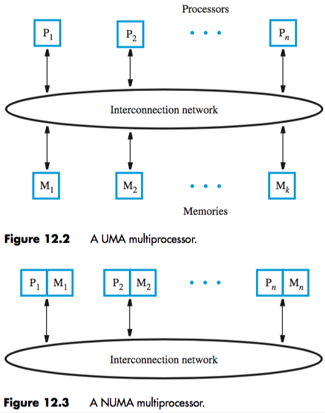

+++
title = 'Shared-memory multiprocessors'
+++
# Shared-memory multiprocessors
multiprocessor system has a lot of processors that can do different tasks at the same time

in a shared-memory multiprocessor, all processors have access to the same memory (probably large)

memory is distributed across multiple modules, connected by an interconnection network

when memory is physically separate processors, all requests go through a network, introducing latency

if you have the same latency for memory access from all processors, you have a Uniform Memory Access (UMA) multiprocessor (but latency doesn’t magically go away)

to improve performance, put a memory module next to each processor
leads to collection of “nodes”, each with a processor and memory module

each node is connected to network. no network latency when memory request is local, but if remote, it has to go through the network

these are Non-Uniform Memory Access ([NUMA](https://youtu.be/jRx5PrAlUdY?t=1m39s)) processors

## Interconnection networks
suitability is judged in terms of:

- bandwidth — capacity of a transmission link to transfer data (bits or bytes per second)
- effective throughput — actual rate of data transfer
- packets — form of data (fixed length and specified format, ideally handled in one clock cycle)

types commonly used:

- buses — set of wires that provide a single shared path for info transfer
    - suitable for small number of processors (low contention)
    - does not allow new request until the response for the current request is provided
    - alternative is split-transaction bus, where request and response can have other events in between them
- ring — point-to-point connections between nodes
    - low-latency option 1: bidirectional ring
        - halves latency, doubles bandwidth
        - increases complexity
    - low-latency option 2: hierarchy of rings
        - upper-level ring connects lower-level rings
        - average latency is reduced
        - upper-level ring may become a bottleneck if low-level rings communicate frequently
- crossbar — direct link between any pair of units
    - used in UMA multiprocessors to connect processors to memory modules
    - enables many simultaneous transfers, if one destination doesn’t get multiple requests
- mesh — like a net over all nodes
    - each node connects to its horizontal and vertical neighbours
    - wraparound connections can be introduced at edges — “torus”
