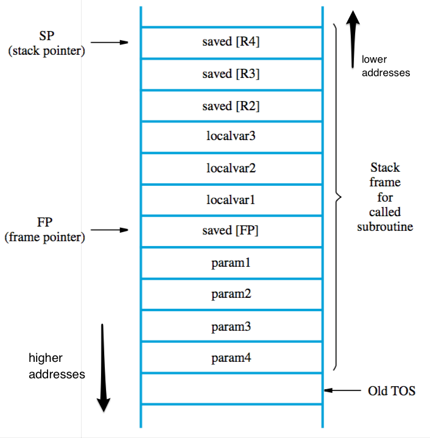

+++
title = 'Subroutines & the stack'
+++
# Subroutines & the stack
## Subroutines

allow a block of instructions to be called any number of times without having to rewrite it

calling a subroutine:
1. Store contents of PC in link register (contains return address)
2. Branch to target address specified by call instruction
3. Execute whatever code is there
4. When return is called, branch to address in link register

when nesting, the return address is pushed to the stack by the caller. on return the callee pops the saved return address from the stack into the link register.

parameters can be passed by:

- registers — convenient & efficient, but may not be enough registers
- processor stack — can pass an arbitrary amount of parameters

## Stack
a pile of stuff where the stuff can only be added to or taken from the top

also called LIFO (last-in-first-out)

push (add elements)
1. subtract 4 from SP (32-bit)
2. move value from register to address stored in SP

pop (remove elements)
1. move value from byte at address stored in SP to register
2. add 4 to SP (32-bit)

processor stack is used for storing data, e.g. parameters, registers

stack pointer register (SP) holds address of top element in stack

‘grows downwards’ — from high to low addresses, decreasing size

stack fame — ‘private workspace’ for a subroutine

- allocated at start, deallocated at end of subroutine
- can also be used for local memory variables
- base/frame pointer points to base of current frame, can easily access parameters by using offset(%rbp)

