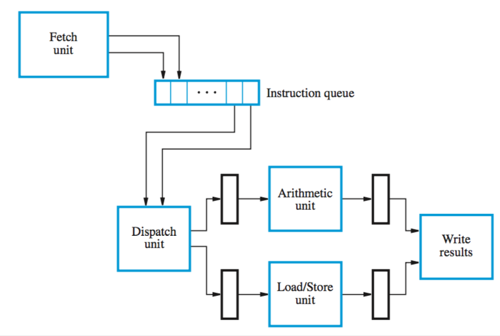
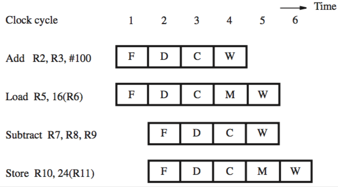

+++
title = 'Superscalar operation'
+++
# Superscalar operation
for a pipelined processor, the maximum throughput is one instruction per clock cycle

equip a processor with multiple execution units, each of which is pipelined, and it can handle several instructions in parallel

the processor is multiple-issue — several instructions execute in same clock cycle but different execution units

can achieve throughput of more than one instruction per cycle — superscalar processors

the fetch unit can get two or more instructions per cycle and put them in an instruction queue

a dispatch unit takes two or more instructions from front of queue, decodes them, and sends them to execution units

superscalar processor with two execution units:

instruction flow in this processor:

this leads to out-of-order execution, so results have to be saved in temporary registers

the temporary registers assume the role of the permanent registers and store the result of the instruction

the commitment unit guarantees in-order commitment using a reorder buffer (queue)

when an instruction reaches the head of the queue, the data is transferred from a temporary register to a permanent register
