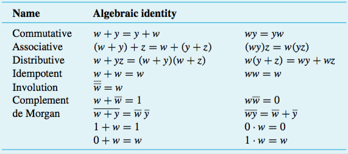

+++
title = 'Synthesis of logic functions'
+++
# Synthesis of logic functions
## Start with a truth table:

| x₁ | x₂ | x₃ | ƒ₁ |
| --- | --- | --- | --- |
| 0   | 0   | 0   | 1   |
| 0   | 0   | 1   | 1   |
| 0   | 1   | 0   | 0   |
| 0   | 1   | 1   | 1   |
| 1   | 0   | 0   | 0   |
| 1   | 0   | 1   | 0   |
| 1   | 1   | 0   | 0   |
| 1   | 1   | 1   | 1   |

## Create a sum-of-products form for each row in which ƒ₁ = 1:
```
(x₁, x₂, x₃) = (0, 0, 0) = 1 —> (x̄₁ x̄₂ x̄₃) = 1
(x₁, x₂, x₃) = (0, 0, 1) = 1 —> (x̄₁ x̄₂ x₃) = 1
(x₁, x₂, x₃) = (0, 1, 1) = 1 —> (x̄₁ x₂ x₃) = 1
(x₁, x₂, x₃) = (1, 1, 1) = 1 —> (x₁ x₂ x₃) = 1
```

All of this combined is therefore:

```
∴ƒ₁ = x̄₁ x̄₂ x̄₃ + x̄₁ x̄₂ x₃ + x̄₁ x₂ x₃ + x₁ x₂ x₃
```

## Then, minimise the function:
The reason for this is to save components and increase performance.

Useful logic rules (can be proved using truth tables):



Can also use [Karnaugh Maps](../karnaugh-maps)

With the function from above:

```
ƒ₁ = x̄₁ x̄₂ x̄₃ + x̄₁ x̄₂ x₃ + x̄₁ x₂ x₃ + x₁ x₂ x₃
   = x̄₁ x̄₂ (x̄₃ + x₃) + (x̄₁ + x₁) x₂ x₃
   = x̄₁ x̄₂ (1) + (1) x₂ x₃
   = x̄₁ x̄₂ + x₂ x₃
```

## Don’t-care conditions

Same values of inputs never occur, so we don’t care about their output. If we use four variables to denote numbers 0..9, six combinations will never be used. Therefore their output is a d.

We can make the output whatever we want it to be. Make it a 1 whenever it enlarges a group of 1s, as it leads to a minimal logic gate implementation.
