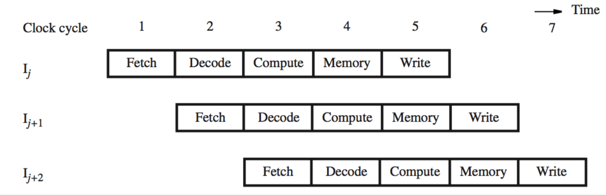
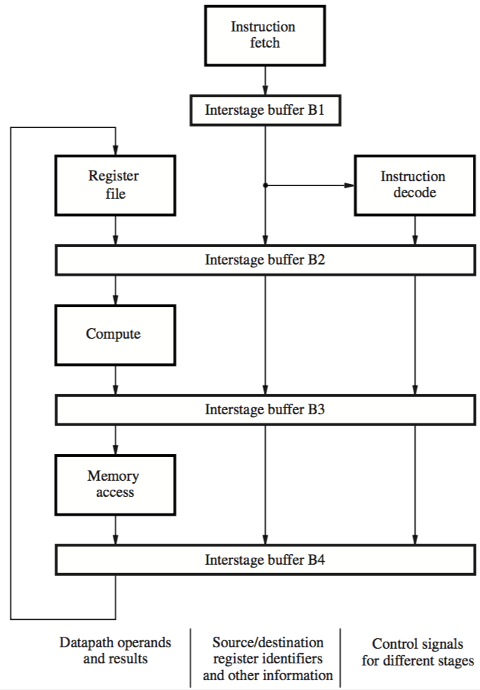

+++
title = 'The basic concept'
+++
# The basic concept
pipelining — a way of organising concurrent activity in a computer system, where instructions move through the components in an “assembly line” style

multiple operations happening at the same time

information (register addresses, immediate data, operations) is held in interstage buffers

in a five-stage pipeline:

but this is an ideal case. if the destination register for instruction Iᵢ is the source register for instruction Iᵢ₊₁, problems happen.

pipeline has to stall because of the data hazard
