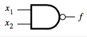
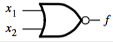

+++
title = 'Universal gates'
+++
# Universal gates
## NAND (NOT AND)
Acts the same as AND => NOT

Any function in sum-of-products (AND-OR) form can be synthesised in NAND-NAND form

## NOR (NOT OR)
Acts the same as OR => NOT

Any function in product-of-sums (OR-AND) form can be synthesised in NOR-NOR form.

