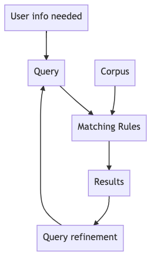

+++
title = 'Searching & Search Engines'
+++
# Searching & Search Engines
Classic info retrieval model:

Search types:

- Boolean search: terms (words) combined with AND/OR/NOT
- Ad hoc query: one-time
- others: browsing, recommender, social bookmarking

Search engines

- index pages: locally stored summaries
- index building

    1. Crawling: follow links of pages they already know
    2. Preprocessing

        - Remove HTML tags
        - Tokenisation (split words on spaces)
        - Remove words like I, the it, a….
        - Take stem of words (e.g. "walking" -> "walk")

    3. Build an index

        - simple — term document matrix
            - 1 if term appears in document, otherwise 0
            - to answer query, bitwise AND the term vectors
        - better — inverted index (just a standard index)
            - for each term, store a list of all the documents containing it
            - terms are looked up in index, docs followed using ID
- judging search engine fucntionality
    - ask human raters to judge (because it's subjective)
    - mathematical — precision, recall (need to know how to calculate this!)
        - there's a tradeoff between precision & recall
        - as recall increases, precision decreases
        - F-measure is the harmonic mean of precision & recall
        - precision at N only includes the first N results
- ranking
    - weighting scheme tf.idf:
        - every word is given a weight for a document, some are more important than others
            - tf: term frequency
            - idf: inverse document frequency
    - Zipf's law: frequency of a word is inversely proportional to its rank in the frequency table
    - Heap's law: most common words are encountered quickly while scanning, but you continue to encounter new words (so you need to keep indexing)
    - PageRank: absolute score for a page
